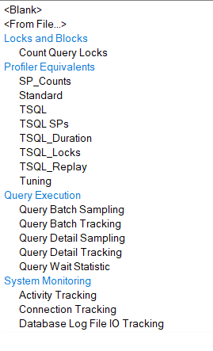

+++ 
draft = false
date = 2024-11-02T17:02:56-04:00
title = "I clicked through the XEvent New Session Wizard so you don't have to"
description = "Side cut XEvent trivia you probably don't care about"
slug = "xevent-wizard-disambiguation"
authors = ["Peter Vandivier"]
tags = ["sql-server-management-studio","extended-events"]
categories = []
externalLink = ""
series = []
+++

I hate using "the GUI" for production work as a rule. That said, I _do_ love playing with it - it's like exploring a new map in a video game. There's a lot you don't know that you don't know and the graphic interface is a lot less dry than API docs when you're just bumbling around doing discovery. 

Recently I was playing with the XEvent New Session Wizard in SSMS. There's a lot of Templates you can start from, but the GUI takes an annoying amount of time to load each time you select a new one; so I figured I'd collate the data.

| ordinal position | group | template name | description | template file name |
| --- | --- | --- | --- | --- |
| 1 | Locks and Blocks | Count Query Locks | This template counts the number of locks acquired by each query based on the query_hash value. You can use this template to identify the most lock intensive queries for investigation and tuning. | xevent\xe_query_lock_counts.xml |
| 2 | Profiler Equivalents | SP_Counts | "This template matches the 'SP_Counts' template in Profiler.  | Captures stored procedure execution behavior over time. " | xevent\xe_Profiler_SP_Counts.xml |
| 3 | Profiler Equivalents | Standard | This template matches the 'Standard' template in Profiler. Generic starting point for creating a trace. Captures all stored procedures and Transact-SQL batches that are run. Use to monitor general database server activity. | xevent\xe_Profiler_Standard.xml |
| 4 | Profiler Equivalents | TSQL | "This template matches the 'TSQL' template in Profiler.  | Captures all Transact-SQL statements that are submitted to SQL Server by clients and the time issued. Use to debug client applications." | xevent\xe_Profiler_TSQL.xml |
| 5 | Profiler Equivalents | TSQL SPs | This template matches the 'TSQL_SPs' template in Profiler. Captures detailed information about all executing stored procedures. Use to analyze the component steps of stored procedures. Add the sql_statement_recompile event if you suspect that procedures are being recompiled. | xevent\xe_Profiler_TSQL_Sps.xml |
| 6 | Profiler Equivalents | TSQL_Duration | This template matches the 'TSQL_Duration' template in Profiler. Captures all Transact-SQL statements submitted to SQL Server by clients and their execution time (in microseconds). Use to identify slow queries.  | xevent\xe_Profiler_TSQL_Duration.xml |
| 7 | Profiler Equivalents | TSQL_Locks | This template matches the 'TSQL_Locks' template in Profiler. Captures all of the Transact-SQL statements that are submitted to SQL Server by clients along with exceptional lock events. Use to troubleshoot deadlocks, lock time-out, and lock escalation events.  | xevent\xe_Profiler_TSQL_Locks.xml |
| 8 | Profiler Equivalents | TSQL_Replay | This template matches the 'TSQL_Replay' template in Profiler. Use to perform iterative tuning, such as benchmark testing. | xevent\xe_Profiler_TSQL_Replay.xml |
| 9 | Profiler Equivalents | Tuning | This template matches the 'Tuning' template in Profiler. Captures information about stored procedures and Transact-SQL batch execution. | xevent\xe_Profiler_Tuning.xml |
| 10 | Query Execution | Query Batch Sampling | This template collects batch and RPC level statements as well as error information. You can use this template to understand the flow of queries that are executing on your system and track errors back to the queries that caused them. Events are only collected from 20% of the active sessions on the server at any given time. You can change the sampling rate by modifying the filter for the event session. | xevent\xe_batch_sampling.xml |
| 11 | Query Execution | Query Batch Tracking | This template collects batch and RPC level statements as well as error information. You can use this template to understand the flow of queries that are executing on your system and track errors back to the queries that caused them. All batch events are collected in this session so collection size may be very large. To reduce the collection size, consider using the Query Batch Sampling template, which already includes a filter. | xevent\xe_batch_tracking.xml |
| 12 | Query Execution | Query Detail Sampling | This template collects detailed statement and error information. You can use this template to track each statement that has executed on your system as a result of query batches or stored procedures and track errors back to the specific statement that caused them. This template also collects the query hash and query plan hash for every statement it tracks. Events are only collected from 20% of the active sessions on the server at any given time. You can change the sampling rate by modifying the filter for the event session. | xevent\xe_statement_sample.xml |
| 13 | Query Execution | Query Detail Tracking | This template collects detailed statement and error information. You can use this template to track each statement has executed on your system as a result of query batches or stored procedures and then track errors back to the specific statement that caused them. This template also collects the query hash and query plan hash for every statement it tracks. All statement events are collected in this session so collection size may be very large. To reduce the collection size consider using the Query Detail Sampling template, which already includes a filter. | xevent\xe_statement_tracking.xml |
| 14 | Query Execution | Query Wait Statistic | This template tracks internal and external wait statistics for individual query statements, batches and RPCs. This template also collects the query hash and query plan hash for every statement it tracks. Events are only collected from 20% of the active sessions on the server at any given time. You can change the sampling rate by modifying the filter for the event session. | xevent\xe_query_wait_stats.xml |
| 15 | System Monitoring | Activity Tracking | This template is similar to the 'Default Trace' that exists in the SQL Trace system. Use this template to track general activity on your system. The difference between this template and the 'Default Trace' is that this template does not include security audit events. If you would like to audit your system you should use the SQL Server Audit feature. | xevent\xe_activity.xml |
| 16 | System Monitoring | Connection Tracking | This template tracks connection activity for a server. Normal connection activity is tracked using the login and logout events, and problems are recorded using the connectivity_ring_buffer_recorded event. | xevent\xe_connection_tracking.xml |
| 17 | System Monitoring | Database Log File IO Tracking | This template monitors the IO for database log files on a server by tracking asynchronous IO, database log flushes, file writes, spinlock backoffs of type LOGFLUSHQ and waits of type WRITELOG. This template collects data in two ways: raw data is collected to a ring buffer and spinlock backoff information is aggregated based on the input buffer (sql_text). The session is filtered for a single log file per database; if you have multiple log files you can modify the filter for the file_write_completed and file_written events to include more than just file_id = 2. | xevent\xe_log_io_tracking.xml |

The template files are all relative to a subdirectory the SSMS application root. For me this is `C:\Program Files (x86)\Microsoft SQL Server Management Studio 20\Common7\Templates\sql`. There's 17 template files in the `.\xevent` subdirectory corresponding to the 17 drop down options. These files are generally pretty easy to read (as far as XML files go). There's 8 additional template files in the `.\dbscopedxevent` directory as well as an SSAS tracing template file at `Templates\olap\xevent\xeas_default_sample.xml`.

Annoyingly the New Session Wizard locks you out of a couple useful interfaces that the New Session not-Wizard presents. For example:
* "_Start session immediately_" & "_Watch live_" radials are both missing
* "_Causality tracking_" radial is omitted 
* You may not "Configure >" from the events selection page, removing a huge swathe of advanced toggling
* Only allows event_file & ring_buffer storage types. Although to be fair these are the only types I ever use. The others available are:
  * etw_classic_sync_target
  * event_counter
  * histogram
  * pair_matching

Seemingly, the only major benefit the Wizard offers over the standard UI is that it makes the target file configuration a little less "clicky". 
